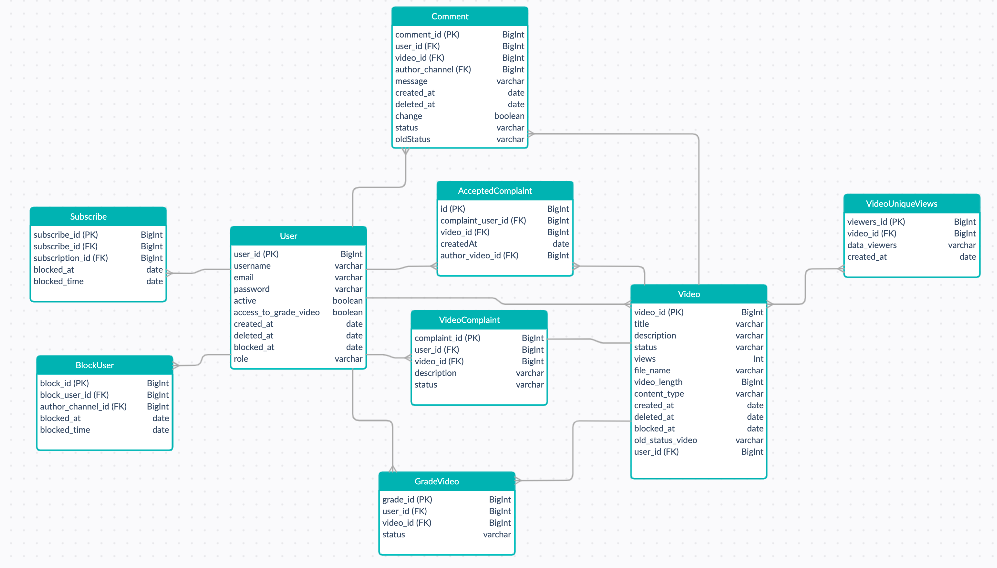

#Java
Проект по типу YouTube. Он далек от реальности, так как с подобными проектами я никогда не сталкивался и опыта у меня особого нет. Есть возможность ставить лайки, подписываться, просматривать список своих подписчиков и подписок, блокировать пользователя на канале и скрывать-удалять его комментарии. Есть возможность удалять видео, но удаление не происходит сразу, а видео лишь скрывается от глаз владельца и от всех пользователей сервиса и хранится в течение 30 дней с момента удаления для того, чтобы его можно было восстановить.~~~~~~~~~~~~

